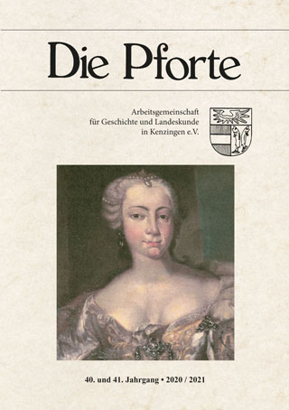

{:target="_blank"}{: .image.right}

Zur Erforschung und Darstellung der Geschichte der Stadt Kenzingen und
ihren Stadtteilen gibt die „Arbeitsgemeinschaft für Geschichte und
Landeskunde in Kenzingen e.V.“ zweijährlich das Sachbuch "Die Pforte"
heraus.

# Ziele der Arbeitsgemeinschaft:

-   Erforschung und Darstellung der Geschichte der Stadt Kenzingen, des
    „Unteren Breisgaus“ (ehem. Amtsbezirk Kenzingen) und die Förderung
    des historischen Bewußtseins der Bevölkerung in Kenzingen und seinen
    Stadtteilen

-   Zweijährliche Herausgabe der heimatkundlichen und geschichtlichen
    Arbeitsergebnisse über Kenzingen und Umgebung in der Publikation
    „Die Pforte“

-   Stadtführungen, geschichtliche Exkursionen, Vorträge und
    Ausstellungen

-   Anerkennung besonderer Leistungen von Schülerinnen und Schülern der
    örtlichen Schulen im Unterrichtsfach „Geschichte“ durch die
    jährliche Verleihung des „Hermann-Sussann-Preises“
