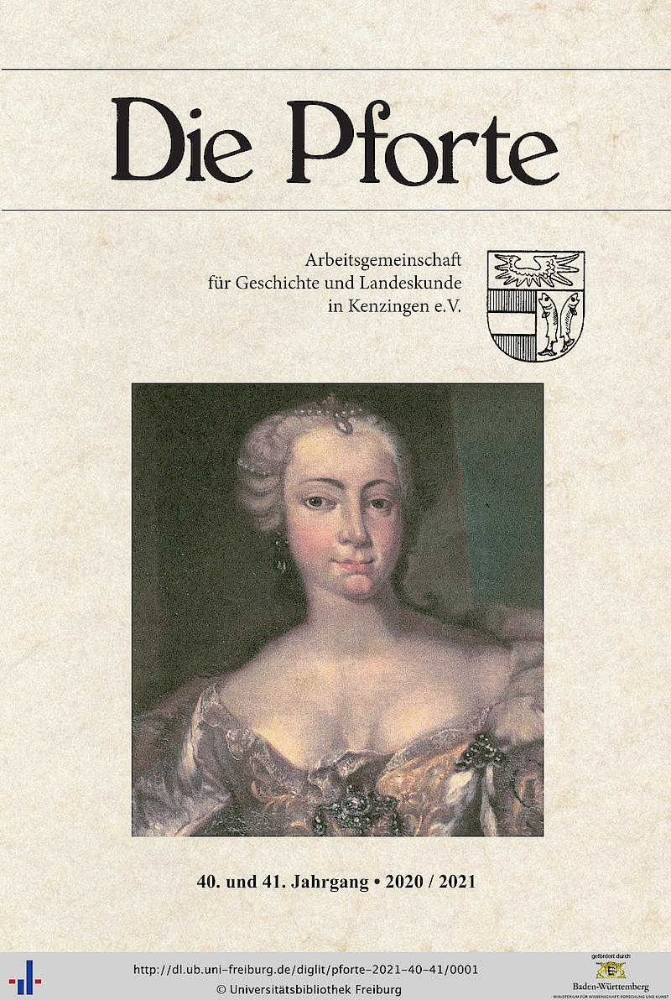
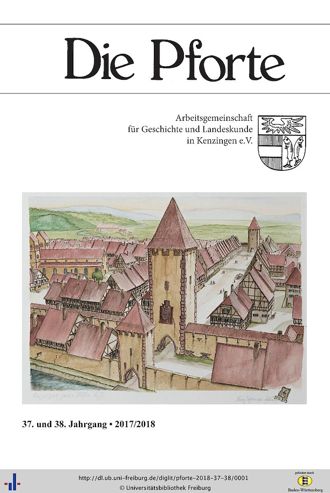
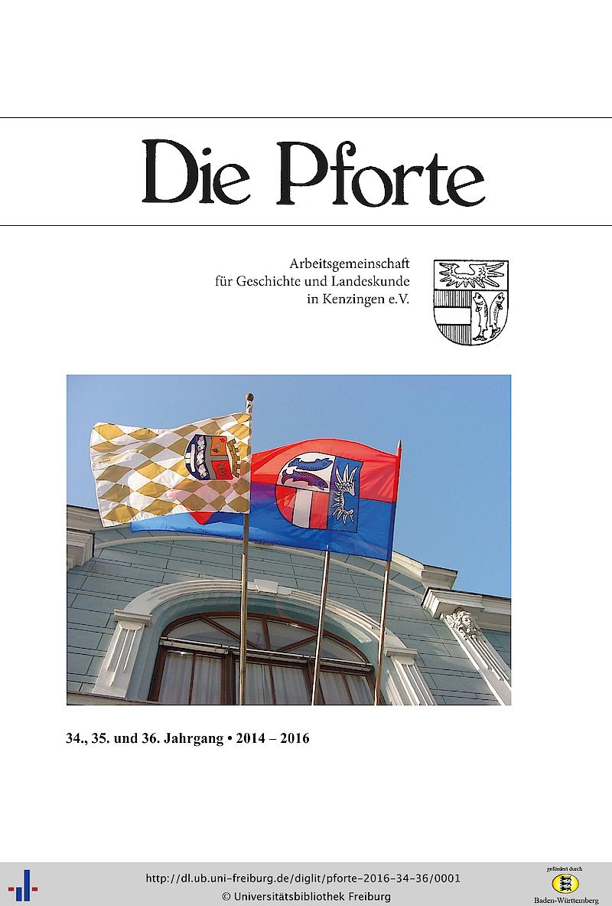
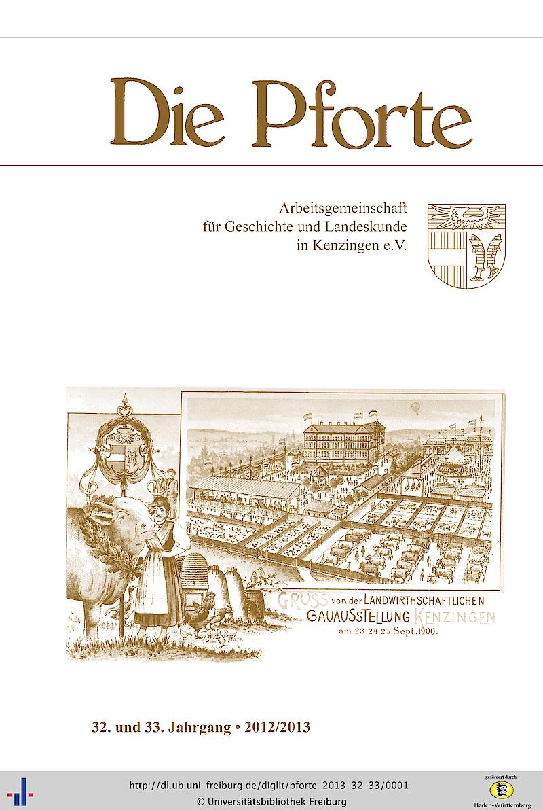
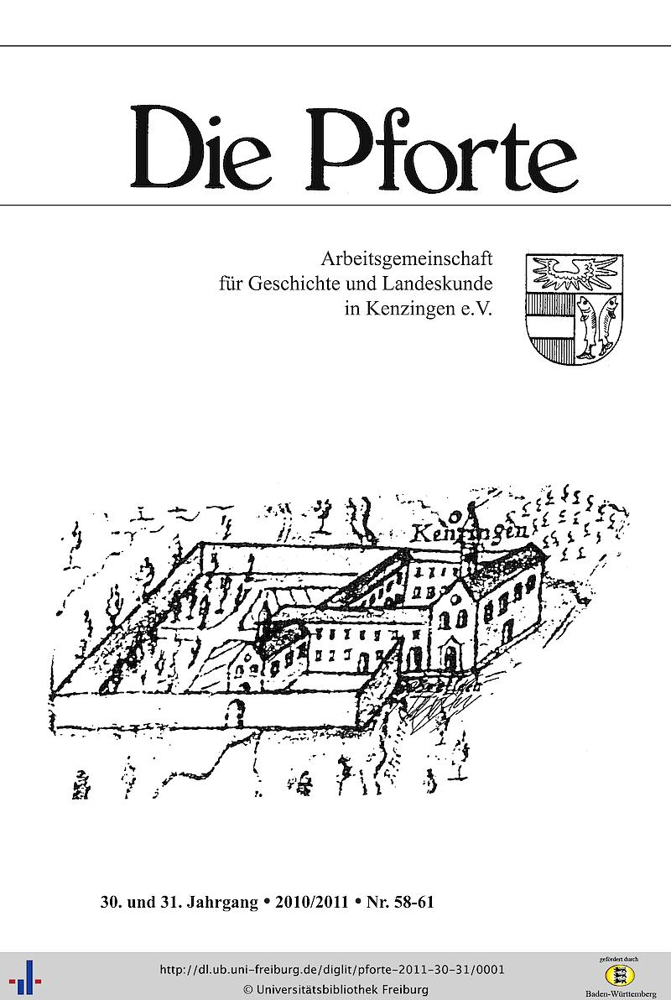
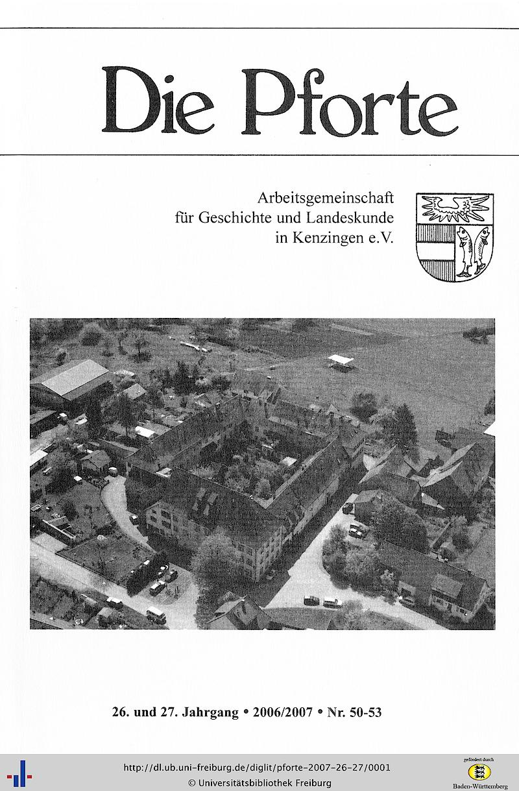
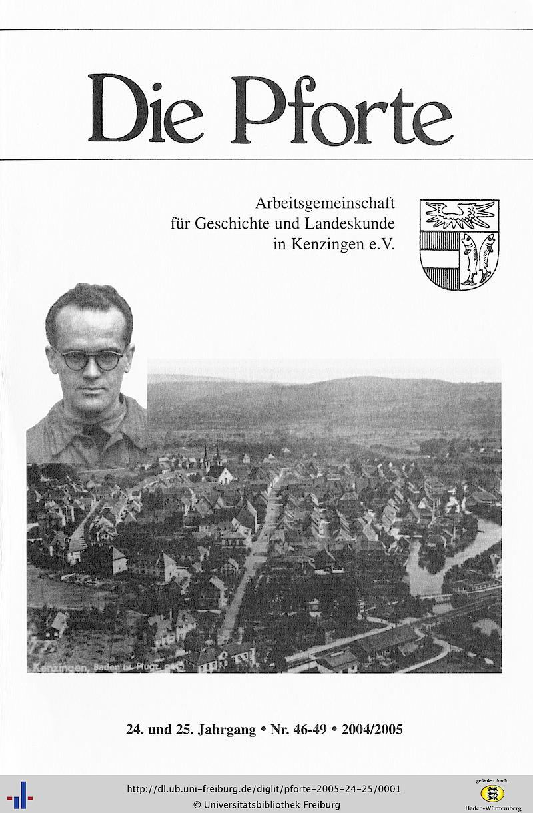
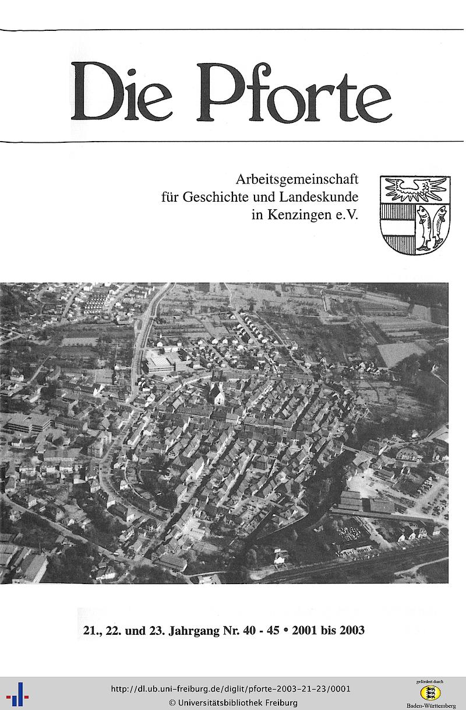
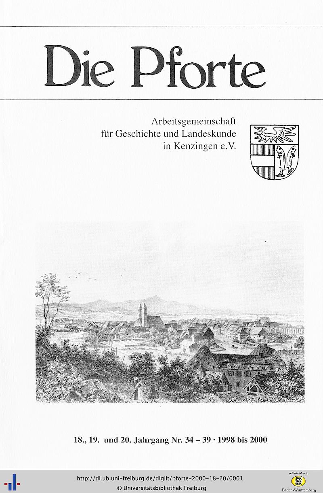

Hier sehen Sie, welche Versionen der "Pforte" noch verf&uuml;gbar sind. Bestand erfahren Sie in k&uuml;rze nach unserer Inventur!

{: .image.left}
{: .image.right}
{: .image.left}
{: .image.right}
{: .image.left}
{: .image.right}
{: .image.left}
{: .image.right}
{: .image.left}
{: .image.right}




