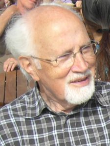

{: .images.right}

Die Arbeitsgemeinschaft für Geschichte und Landeskunde In Kenzingen e.V.
(AgGL) trauert um ihr Ehrenmitglied

Als Gründungsmitglied der Arbeitsgemeinschaft für Geschichte und
Landeskunde in Kenzingen e.V., als Mitglied ihres Vorstandes seit dem
Jahre 1981, als Angehöriger des Redaktionskollegiums der Zeitschrift
„Die Pforte“ sowie als Autor zahlreicher Beiträge für diese Publikation
hat sich Herr Helmut Reiner durch den unermüdlichen, selbstlosen Einsatz
seiner Persönlichkeit, seiner breiten künstlerischen und
wissenschaftlichen Erfahrung sowie seines tief gründenden, auf
humanistischer Bildung ruhenden Wissens hervorragende Verdienste um die
AgGL erworben.

Wir werden Helmut Reiner stets in dankbarer und guter Erinnerung
behalten.

Kenzingen, im November 2018  
Der Vorstand der AgGL und die Redaktion „Die Pforte“
